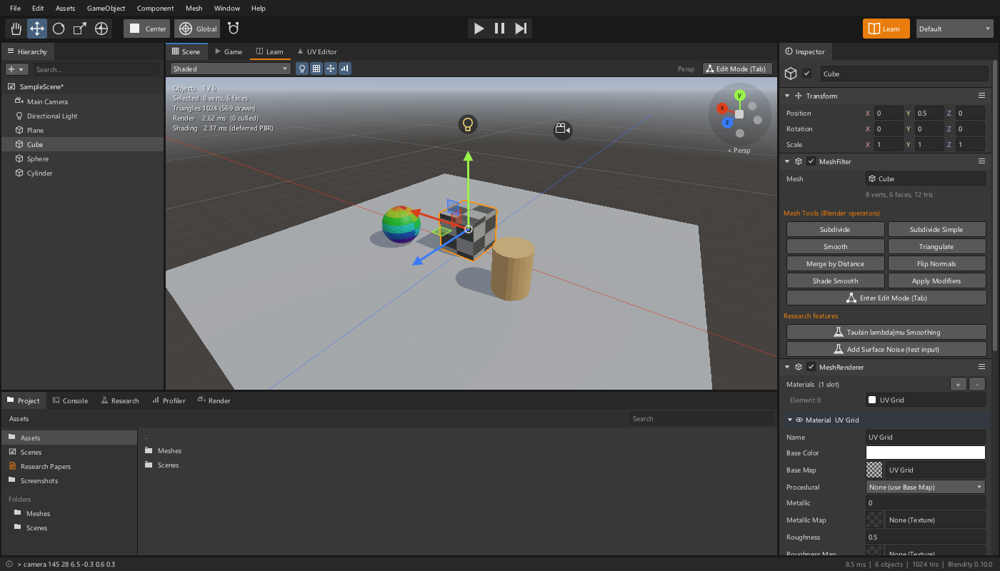
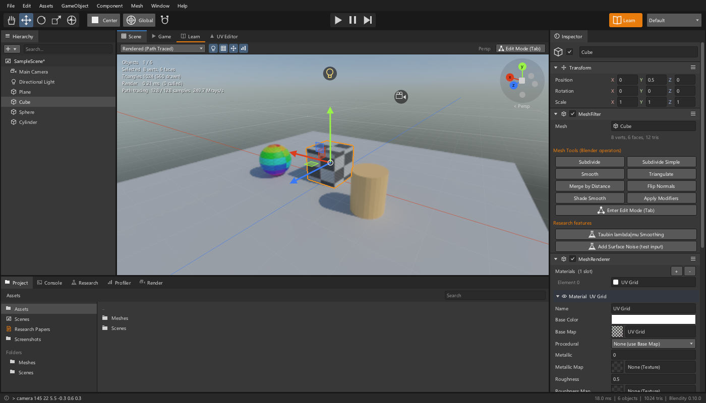
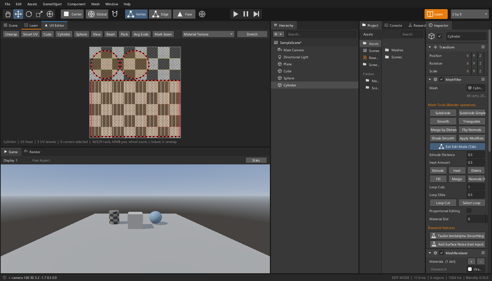
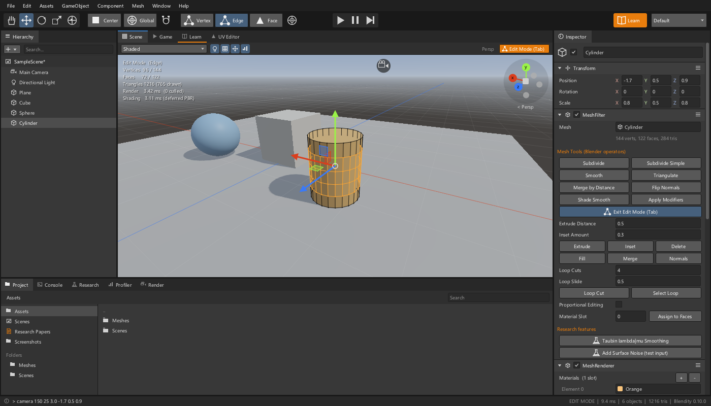
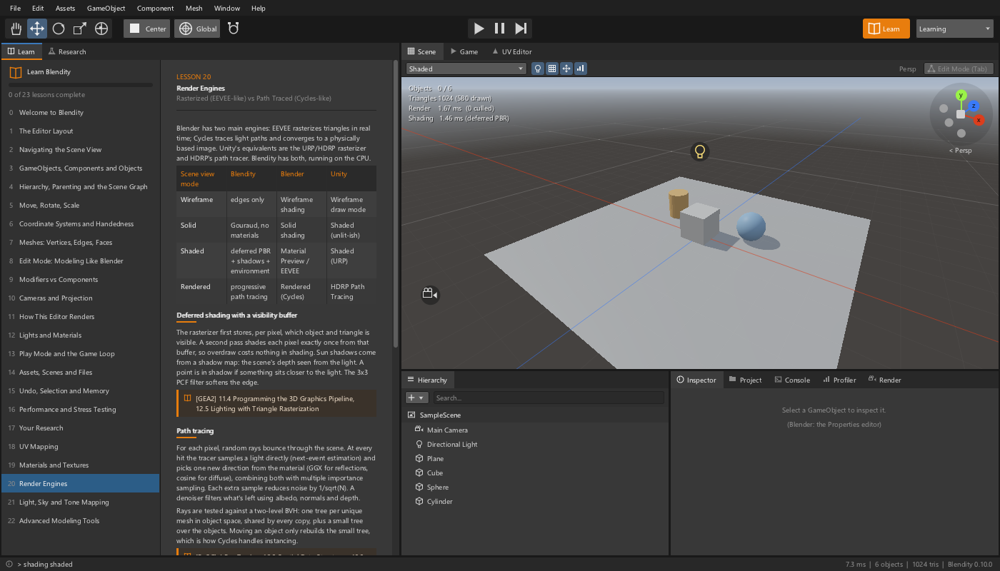

# Blendity

**Blender's modeling, UV, texturing and rendering, driven like Unity.** Blendity is a 3D editor written in C++17. Its windows, navigation, shortcuts, gizmos, Inspector and Play mode follow the Unity editor. Underneath, its meshes, Edit Mode tools, UV unwrapping, Principled materials and two render engines (an EEVEE-like rasterizer and a Cycles-like path tracer) follow Blender's design and source code. A built-in **Learn** tab teaches how each piece maps across Unity, Blender and the graphics theory in the reference books.



| Path-traced viewport | UV Editor (LSCM unwrap) |
|---|---|
|  |  |
| **Edit Mode: loop cuts** | **Learn tab** |
|  |  |

---

## Run it

| Platform | Executable | Status |
|---|---|---|
| **Windows** 10/11 x64 | `dist/windows/Blendity.exe`, with Blender's library DLLs beside it (the dependency-free build is one static file). No installer | Built and tested here (real window + headless) |
| **Linux** x64 (X11 / XWayland) | `dist/linux/Blendity` + `dist/linux/lib/`: needs only `libX11` from the system | Built and tested here (WSL Ubuntu) |
| **macOS** (Apple Silicon / Intel) | `dist/macos/Blendity.app` via `./build.sh` or the CI artifact | ⚠️ Written but **not compiled or run here** (no Mac available). The GitHub Actions workflow builds and tests it on `macos-latest` |

Double-click the executable, or run it from a terminal:

```bash
Blendity --layout Learning      # start with the Learn tab beside the Scene view
Blendity --scene Assets/Scenes/SampleScene.scene
Blendity --scale 1.5            # force UI scale (default follows OS DPI)
Blendity --headless-screenshot out.png --cmd "select Cube" --cmd "shading rendered" --frames 30   # no window
```

New to the editor? Press **F1** (or the orange **Learn** button).

## Build it

You only need a compiler. Blender's own small bundled libraries are already in `extern/`.

**Optional: Blender's prebuilt libraries.** Put Blender's library folder for your platform at `../blender/lib/<platform>` (from `projects.blender.org/blender/lib-windows_x64`, `lib-linux_x64` or `lib-macos_arm64`). The build then picks up Embree, OpenImageDenoise, oneTBB, Eigen, OpenSubdiv, OpenEXR, OpenColorIO, Manifold, meshoptimizer, Open PGL, Jolt, libjpeg-turbo, libpng, zlib, Zstandard, and Vulkan + shaderc (GPU rendering), and copies their runtime files next to the executables. Each one is optional and has a built-in fallback. `BLENDITY_NO_LIBS=1` (or `-DBLENDITY_NO_LIBS=ON`) forces the dependency-free build. Type `libs` in the Console to see what's active.

```bash
build.bat release all            # Windows: finds Visual Studio / Build Tools automatically
```
```bash
./build.sh release all           # Linux (g++ + libx11-dev) and macOS (Xcode command line tools)
```
```bash
cmake -B build && cmake --build build --parallel && ctest --test-dir build   # optional CMake route
```

Each build produces **`Blendity`** (the editor), **`blendity_tests`** (813 unit checks with Blender's libraries; the dependency-free build skips the library ones) and **`blendity_stress`** (the stress and efficiency suite). Pushing to GitHub runs `.github/workflows/build.yml`, which builds, tests and uploads binaries for all three operating systems.

## What you can do

**Model (Blender's Edit Mode, Unity's handles).** Primitives (cube, UV/ico sphere, cylinder, cone, torus, plane, quad). Vertex, edge and face selection, box select, edge loops, gizmo editing with **proportional editing**. Extrude, inset, **loop cut** (any number of cuts, slide), **fill**, **merge at center**, **recalculate normals**, delete, subdivide, smooth, triangulate, merge by distance. Edge tools: **bevel** (rounded with segments), **bridge** two faces or two holes with a tube (at any angle, with different vertex counts, curved with segments), subdivide, connect (J), dissolve and collapse. The tools follow the **selection mode**, as in ProBuilder and Blender: vertex mode offers vertex operations (merge, connect, make face, smooth), edge mode edge operations (bevel, loop cut, bridge, subdivide, dissolve, collapse, seams) and face mode face operations (Push/Pull, extrude, inset, push through, bridge, fuse, materials), in the Mesh menu, the Inspector and the shortcuts alike. **Push/Pull** (P in face mode), like SketchUp's, is a confirmed operation: press P with faces selected, move the mouse or type a distance, then click or press Enter (Esc or right-click cancels). Faces around it that continue in the same plane stretch instead of growing walls, so a box top just moves and a face at an edge makes a clean notch or step. Push all the way to the far side and it becomes a **hole**, cut into the face it comes out of at that face's angle. Pull it onto another face and it **joins** that face, landing at the face's angle even when it isn't parallel. It never passes through the mesh: it stops at the far side or at whatever is in the way, and when the faces around it lean over it, its corners slide along them like Blender's face move. Ctrl keeps the original face. A stress test runs it 26,000 times on awkward meshes (concave n-gons, inside-out, unwelded, non-manifold, 0.1 mm to 10 km, far from the origin) and checks every result. Also from Blender: **Poke, Triangulate, Tris to Quads, Duplicate, Split, Dissolve Faces / Vertices, Extrude Individual, Edge Split, Shrink/Fatten, To Sphere, Randomize, Mark Sharp**, and selection tools (**Linked, More / Less, Invert, Non-Manifold, Edge Ring**). Edge mode keeps the edges you pick (two opposite sides of a quad stay two edges). **Shade Smooth / Flat work per face** and stop at sharp edges (and optionally at UV seams). Blender's modal **G / R / S** work alongside Unity's tools: X / Y / Z axis locks, typed values, Ctrl snap, Esc cancel; see [`docs/USABILITY.md`](docs/USABILITY.md) for how the two keymaps share the keyboard. **Set Origin** (GameObject menu, Inspector > Transform, or the `origin` command) moves the pivot to the bounds centre, the median, the surface or volume centre of mass, the bottom centre, a typed point, the edit selection or the Scene view pivot, without moving anything on screen. **Push Through** (Alt+P) does the hole in one step, and extruding or moving a face onto another face fuses them the same way. After each tool an **Adjust Last Operation** panel (Blender's F9) lets you change its settings and move the result in X / Y / Z or along the normal, as one undo step. Non-destructive modifier components: **Mirror, Array, Solidify**, Subdivision Surface, Smooth, plus **Boolean** (Manifold) and **Decimate** (meshoptimizer) with Blender's libraries.

**UV map.** A UV Editor window (Ctrl+9) with move/rotate/scale, box select, linked select, snapping, a stretch overlay and background images. **Unwrap (LSCM)** with seams, **Smart UV Project**, cube / cylinder / sphere / view projections, reset, **pack islands** (with rotation) and average island scale.

**Texture.** Unity-style Materials evaluating Blender's **Principled BSDF**: base colour, metallic, roughness, specular, normal and emission maps with tiling/offset, UV / box / generated mapping, procedural checker, noise and Blender's UV Grid / Color Grid test images. **Surface types**: Opaque (solid), Cutout (alpha clip), Transparent (alpha blend) and Glass (refraction by IOR, clear or frosted), in both render engines, plus Metal, Emissive and Unlit presets (Element > New Material of Type). Multiple material slots per mesh, assigned per face. PNG, JPEG, TGA, BMP, Radiance HDR and (with Blender's libraries) OpenEXR images, with mipmaps and trilinear filtering. Drag and drop images, **OBJ + MTL** and **FBX** files (via ufbx, which Blender bundles) and their textures come along.

**Render.** Four Scene view modes: Wireframe, Solid, **Shaded** (deferred PBR with sun shadow maps and image-based lighting) and **Rendered** (progressive path tracing). World: gradient, **Hosek-Wilkie physical sky**, **HDRI** or flat colour. View transforms: Standard, Filmic, ACES, plus exposure, and with OpenColorIO **Blender's own views (AgX, the default, Filmic, Khronos PBR Neutral…)**. **Preview** renders a quick low-resolution, low-sample version first (Live Preview re-renders it as you edit), and selecting a camera shows a Unity-style **Camera Preview** in the Scene view (which can be **locked** to keep showing while you edit meshes), either rasterized or **Rendered** (a small progressive path-traced render preview through that camera). **Physical cameras** (Unity's Physical Camera, Blender's lens): focal length, sensor size presets (full frame, APS-C, Super 35, IMAX ...), sensor fit, lens shift, an aspect ratio per camera (16:9, 2.39:1, 4:3, the sensor's ...; the Game view letterboxes to it), **depth of field** from the f-stop and focus distance (with a **focus eyedropper**: click a surface to focus there) with round or polygonal (bladed) bokeh, and exposure from ISO, shutter speed and f-stop. The `set` console command changes any field (`set Camera.FStop 1.4`). Sample counts have halve / double buttons and power-of-two presets (16, 32, 64, 128 ...). **F12** renders the Main Camera with either engine (rasterized with supersampling, or path traced with denoising) to PNG, JPEG, HDR or EXR. With Blender's libraries the path tracer runs on **Embree**, denoises with **OpenImageDenoise**, samples emissive meshes as lights, and offers Cycles-style **path guiding** (Open PGL).

**GPU rendering.** Like Cycles, the path tracer can run on the **GPU**: set Render Settings > Device to *GPU Compute*. One portable backend, **Vulkan**, covers NVIDIA, AMD and Intel GPUs on Windows and Linux (and Apple GPUs through MoltenVK), so there is no separate CUDA / HIP / oneAPI build to pick. On GPUs with **ray tracing hardware** (RTX, Radeon RX 6000+, Arc) rays go through `VK_KHR_ray_query` and its hardware acceleration structures; *Hardware Ray Tracing* turns that off to compare. **Combined rendering** works like Blender's: tick the CPU and any GPUs under *Render Devices* and they all render the same frame, sharing out samples by speed, with results identical to a CPU render (same random sequences). The Vulkan loader is opened at run time, so machines without a GPU driver still start and render on the CPU.

**Lights.** Directional, Point, **Spot** (Unity's Spot Angle and Inner Spot Angle) and **Area** (rectangle or disc, soft shadows when path traced), in the rasterizer and on CPU and GPU path tracing alike, with an optional **colour temperature in kelvin** (black-body tint: 2700 K bulb, 5500 K sun, 6500 K white).

**Files.** **Export OBJ (+ MTL) and FBX** (File > Export, the Hierarchy's right-click menu, or `export obj|fbx [all]`): the selection or the whole scene, with modifiers applied, UVs, smooth / flat normals and materials, mirrored to right-handed axes as Unity's FBX Exporter does. FBX import now uses Unity's convention too (mirror X).

**Inspector.** Colours work like Unity's: a swatch with an alpha bar, and a Color window with a saturation / value square, hue strip, RGB 0-255 / 0-1 / HSV, alpha, hex and swatches (Base Color carries the material's alpha). The Render window has **resolution presets** up to 8K and print sizes, each with its megapixels. Unity-style **multi-object editing**: change a field and every selected object follows. Click any number field (without dragging) and type a value; Tab / Shift+Tab move to the next / previous field, Enter commits, Esc cancels. Number fields take expressions: `2*pi`, `sqrt(2)`, `+=1`, `-=0.5`, `*=2`, `/=4` (relative to each object's own value), Unity's `L(0,10)` (spread evenly across the selection) and `R(0,1)` (random per object).

**Scene and play.** GameObjects with Transform hierarchies and Components (MeshFilter, MeshRenderer, Light, Camera, Rotator, Oscillator, PlayerController, Rigidbody). Play mode copies the scene and restores it on Stop, as in Unity; rigid bodies use **Jolt Physics** when available. Undo/redo, a text `.scene` format, OBJ export, PNG screenshots (Shift+F12).

## Unity controls, Blender tools

| | Blendity (Unity) | Blender |
|---|---|---|
| Orbit / Pan / Zoom | Alt+LMB / MMB / Wheel or Alt+RMB | MMB / Shift+MMB / Wheel |
| Fly | Hold RMB + WASD, Q/E, Shift | Shift+` |
| Frame selection | F | Numpad . |
| Front / top / side views, Persp / Iso | click an axis of the scene gizmo / click its label or centre | Numpad 1 / 3 / 7, Numpad 5 |
| Edit another mesh | click it (Edit Mode moves to it, same vertex / edge / face mode) | Tab out, select, Tab in |
| Create objects | right-click in the Hierarchy | Shift+A |
| View / Move / Rotate / Scale / Transform | Q / W / E / R / Y | — / G / R / S / Transform tool |
| Duplicate / Delete / Rename | Ctrl+D / Del / F2 | Shift+D / X / F2 |
| Play / Pause / Step | Ctrl+P / Ctrl+Shift+P / Ctrl+Alt+P | — |
| Edit Mode / vertex / edge / face | Tab / 1 / 2 / 3 | Tab / 1 / 2 / 3 |
| Grab / rotate / scale (modal) | G, then X / Y / Z, a typed value, click; R / S during a G (or Blender Transform Keys) | G / R / S |
| Extrude / Inset / Bevel (follow the mouse) | Ctrl+E / I or Ctrl+I / Ctrl+B (wheel: segments) | E / I / Ctrl+B |
| Select edge loop | double-click an edge, or **Alt+click** (Ctrl+Alt+click: ring; face mode: face loop) | Alt+click |
| Loop cut | Ctrl+R over an edge | Ctrl+R |
| Push/Pull (SketchUp), face mode | P, move or type a distance, click / Enter (Esc cancels) | (Extrude + Boolean) |
| Set Origin | GameObject > Set Origin, Inspector > Transform > Origin | Object > Set Origin |
| Triangulate / Tris to Quads / Duplicate / Dissolve | Ctrl+T / Alt+J / Shift+D or Ctrl+D / Ctrl+X | Ctrl+T / Alt+J / Shift+D / X > Dissolve |
| Select Linked / More / Less / Invert | Ctrl+L / Ctrl+= / Ctrl+- / Ctrl+Shift+I | Ctrl+L / Ctrl+Numpad + / - / Ctrl+I |
| Shrink/Fatten / To Sphere | Alt+S / Shift+Alt+S | Alt+S / Shift+Alt+S |
| Bevel / Bridge / Push Through | Ctrl+B / Ctrl+Shift+B / Alt+P | Ctrl+B / Bridge Edge Loops / (a Boolean) |
| Connect / Dissolve edges | J / Ctrl+X | J / Ctrl+X |
| Adjust Last Operation | F9 (panel at the Scene view's bottom left) | F9 |
| Fill / Merge at center / Recalculate normals | Alt+F / Alt+M / Shift+N | F / M / Shift+N |
| Proportional editing | O (scroll while dragging to resize) | O |
| UV Editor / Unwrap | Ctrl+9 / U | UV Editing workspace / U |
| Render image / Render window | F12 / F11 | F12 / F11 |
| Snap while dragging | hold Ctrl | hold Ctrl |
| Windows | Ctrl+1 Scene, 2 Game, 3 Inspector, 4 Hierarchy, 5 Project, 6 Console, 7 Profiler, 8 Research, 9 UV Editor | — |

**Windows:** Scene, Game, Hierarchy, Inspector, Project, Console (with a command line; type `help`), **UV Editor**, **Render**, **Learn**, **Research** and **Profiler**. Drag tabs to dock or split them; Window → Layouts has the Default, 2 by 3, Tall, Wide and Learning presets.

## The Learn tab

26 lessons, each linking the **Unity concept ↔ Blender concept and source file ↔ theory**, with chapter citations from the books in *Blender Documents*:

- **[FoCG]** Marschner & Shirley, *Fundamentals of Computer Graphics*, 5th ed.
- **[GEA1]** / **[GEA2]** Gregory, *Game Engine Architecture* Vol. I and II

They cover the editor layout, navigation, GameObjects vs Objects, scene graphs, transforms, handedness, mesh storage, Edit Mode, modifiers, cameras, the rasterizer, lighting, the game loop, files, undo, performance and research, **UV Mapping**, **Materials and Textures**, **Render Engines**, **Light, Sky and Tone Mapping**, **Advanced Modeling Tools**, **Libraries and Performance**, and new in this release **Bevel, Bridge and Push Through** (Blender's external libraries, profiling, SIMD and multithreading). Lessons have "Try it" buttons that drive the editor, reveal-on-click self-checks and links into the matching folder of the Blender source tree. The text is my own wording; the books are cited, not reproduced.

## Your research papers

Drop papers onto the editor window or into **`research/papers/`**. They appear in the **Research** tab. Then ask Claude Code to implement a technique; features register in `src/research/` and show up in the Research tab, the Mesh menu and the Inspector. A worked example is included: **Taubin's λ|μ smoothing** (SIGGRAPH '95). See [`research/README.md`](research/README.md) and [`research/FEATURES.md`](research/FEATURES.md).

## Stress tests and efficiencies

`blendity_stress` pushes every subsystem until it breaks a time budget and compares naive and optimized implementations. Highlights from this machine (Ryzen 9 5900XT, 32 threads):

- **≈5.2M triangles at 60 FPS** in the software rasterizer (1280×720, measured on an idle machine; about half that under background load), after this pass's triangle-setup rework: an AVX2 kernel rejects 8 triangles per step, triangles that cover no pixel centre are dropped, and only vertices of surviving triangles are lit. 21M triangles went **174 → 34 ms** in a same-session A/B
- **Display encoding 15.7× faster** on one core (SSE4.1 / AVX2 kernels chosen at run time, plus an exact sRGB table instead of `pow()`)
- **GPU rendering (Vulkan): 55× the CPU** on an RTX 4070 SUPER with its ray tracing hardware (1,150 vs 21 samples/s at 1280×720), 7.5× with Blendity's BVH in a compute shader, and **60×** with an RTX 3060 Ti added (multi-GPU). Caching optimised SPIR-V cut the first GPU render on a new machine from 212 s (a cold driver compiling unoptimised SPIR-V) to 9 s
- Path tracer: **22–47 Mrays/s** on Blendity's own BVH, **64–95 Mrays/s with Embree** (2–2.9×). Earlier releases quoted 70–240 Mrays/s from an approximate ray counter; rays are now counted exactly. A **two-level (instanced) BVH** made rebuilding a 21M-triangle scene **34 s → 16 ms**
- Blender's libraries vs Blendity's fallbacks: TBB dispatch 6.5×, Jolt 13.9× at 2,000 bodies, libjpeg-turbo 3.2×, OpenImageDenoise 37% lower error than À-Trous, zstd scenes 51× smaller. Sampling emissive meshes as lights made path tracing 12.7× more efficient in a lit-doorway scene. **OpenSubdiv and path guiding were slower** here, so both stay opt-in
- Edit-mode tools on a 1M-face mesh: **edge loop 46×**, loop cut 8×, recalculate normals 7× faster after replacing a hash map with a CSR adjacency table; LSCM unwrap 10× faster (and Eigen's direct solver another 1.2–1.8×)
- Earlier passes: edge table 8.5×, scene save 13×, mesh load 3.6×, Catmull-Clark 2.2×, copy-on-write undo 1,500×
- **Push/Pull stress:** 26,620 operations on 26 awkward meshes (concave n-gons, inside-out, unwelded, non-manifold, 0.1 mm to 10 km, far from the origin) went from **7,088 broken results to 2**, through ten fixes the test pointed at; every interactive Push/Pull undoes exactly

Full results, including what didn't help, are in [`docs/PERFORMANCE.md`](docs/PERFORMANCE.md).

## Project layout

```
blendity/
├── src/            engine + editor (docs/ARCHITECTURE.md maps each part to Blender's source)
│   ├── image/      PNG/JPEG/TGA/BMP/HDR codecs (+ OpenEXR, libpng, libjpeg-turbo), mipmapped textures
│   ├── render/     rasterizer, deferred shading, shadows, sky, path tracer, SIMD display encoding, OCIO
│   ├── scene/      meshes + operators, UV tools, materials, import, scene IO, Boolean / Decimate, physics
│   ├── editor/     Unity-style editor, UV Editor, Render window, Learn tab
│   └── deps/       which of Blender's optional libraries were compiled in
├── extern/         small libraries Blender bundles (ufbx, fast_float, MikkTSpace, Hosek-Wilkie sky)
├── stress/         stress suite + results/
├── tests/          unit tests
├── Assets/         your project's scenes, meshes and textures (the Project window)
├── research/       papers/ drop folder, FEATURES.md tracker
├── docs/           ARCHITECTURE.md, PERFORMANCE.md, images/
├── licenses/       license texts and what they mean for the executables
└── build.bat · build.sh · CMakeLists.txt · .github/workflows/build.yml
```

## Why not a Blender fork?

Blender's full build needs about 40 external libraries (Python, OpenImageIO, Boost, OSL, USD…) and a large build system. Blendity re-implements the subsystems you asked for in plain C++ and documents which Blender source files each part corresponds to, so it builds with nothing but a compiler. Where Blender's prebuilt libraries are available, it links the 16 that matter for these features (ray tracing, denoising, threading, colour management, booleans, physics, image formats) instead of reimplementing them. Each comes with a measured comparison against Blendity's own fallback. Not recreated: sculpting, animation and rigging, node editors, geometry nodes, grease pencil, the compositor and sequencer, Python, and `.blend` files. See [`docs/ARCHITECTURE.md`](docs/ARCHITECTURE.md).

## License

Source: GPL-2.0-or-later, the same as Blender (`LICENSE`). The executables also contain MIT, BSD-3-Clause and Apache-2.0 code from Blender's bundled libraries, and, when built with Blender's prebuilt libraries, code under Apache-2.0, BSD, MIT, MPL-2.0, Zlib, libpng and TOST licenses. So **binaries are distributed under GPL-3.0-or-later**. The license texts are copied next to the executables. Details in [`licenses/README.md`](licenses/README.md).
